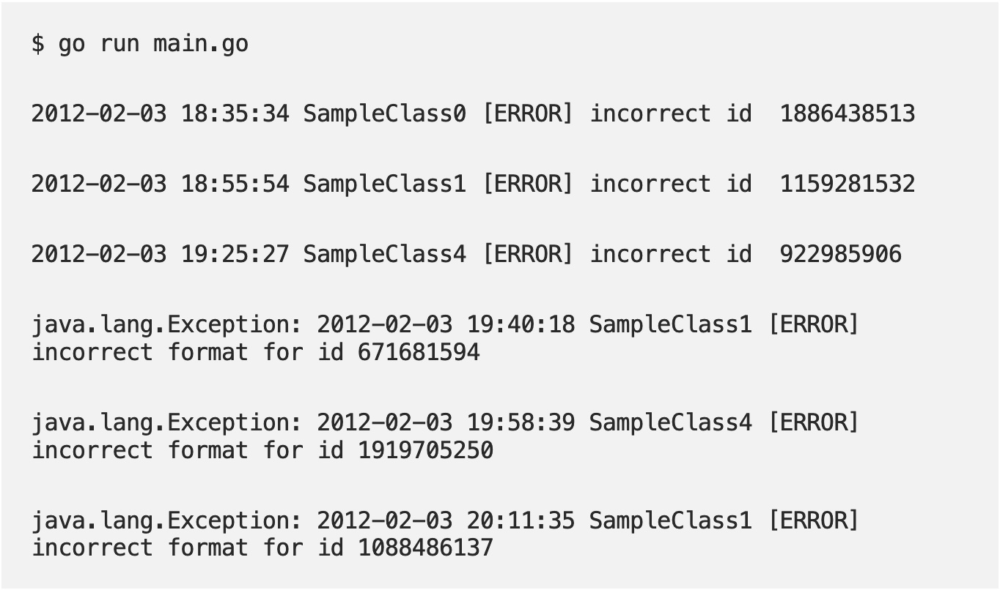
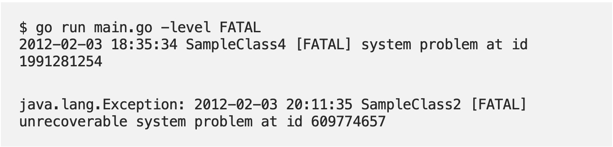
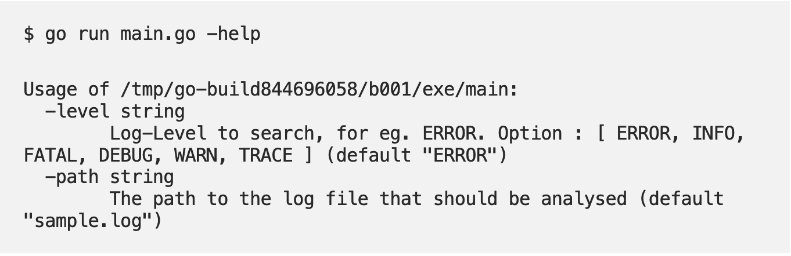

# go-cli
## A Simple Golang CLI Application
### This application uses Golangs *flag* package to filter logs by level:
- **ERROR**
- **INFO**
- **FATAL**
- **DEBUG**
- **WARN**
- **TRACE**

### Usage
---
#### Default (ERROR)
> go run main.go

---
#### Different Log Levels
> go run main.go -level {{DesiredLogLevel}}

---
#### Help Message
> go run main.go -help

---
### Sources
*Source: [sagarsonwane](https://sagarsonwane230797.medium.com/creating-your-first-cli-app-in-golang-d714635b7e17)* 
